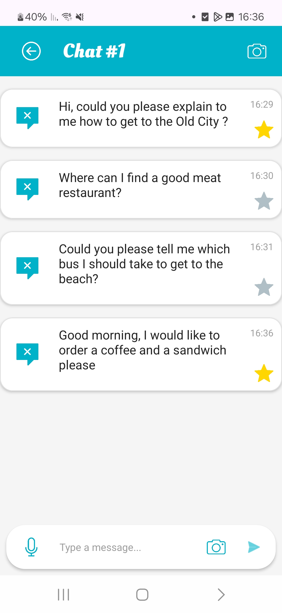

# Splash Screen

The Splash Screen is the entry point of the application. It features the app title **"SLution"**, an animated logo to enhance user engagement, and a **START** button. 

Upon tapping the START button, users are navigated to the **Google Authentication** screen. This screen sets the tone and branding for the app while preparing the user for the sign-in process.

  

  

# Google Authentication Screen

This screen allows users to sign in using one of three available methods: **Email**, **Phone**, or **Google Account**.

The app logo is displayed prominently to maintain brand identity. Once the user successfully signs in, they are redirected to the **Home Screen**. This screen ensures secure and flexible access to the app.

  

  

# Home Screen

The Home Screen serves as the main hub of the app. Users can:
- **View recent conversations** from their translation history.
- **Start a new translation session** by tapping the **New Translation Chat** button.
- **Access saved favorite phrases** by tapping the **Favorites Messages** button.
- **Navigate to user settings** to update personal information or preferences.

This screen provides quick access to essential features, enhancing user experience and productivity.

  

### When accessing the home screen for the first time, without any chat history, the following screen will appear.

  

  

### When starting new conversations, the home screen appears as follows:

By clicking on one of the chats, the full conversation view is displayed, including all previously exchanged messages.

  

  

# Translation Chat Screen

### When clicking the "New Chat" button, the following screen is displayed:

  

  

This screen facilitates interactive communication and translation. 

Users can:
- **Type a message** for translation.
- **Record a voice message**, which is automatically transcribed into text.
- **Save specific messages to Favorites** for future reference.
- **Tap the Camera button** to navigate to the **Gesture Translation Screen**, where the camera captures user gestures and translates them into text.

All messages are stored in the database and displayed in a chat-like format, allowing users to track and revisit their conversations.
  

### After using the chat, the screen appears as follows:

  

  

### By clicking the microphone icon allows users to record a voice message that is transcribed into text.  
This feature is designed to assist individuals who want to respond verbally to someone communicating in sign language.

  

  

### By clicking the camera icon, the user is taken to a split-screen interface.  
The top section captures and translates sign language into text, which is then displayed in the bottom section.  
A confirmation button is provided to verify the accuracy of the translation and return the user to the chat screen with the confirmed text.

  

  

# Favorite Messages Screen

This screen displays all messages that the user has marked as favorites by tapping the **star icon**. 

It provides quick and easy access to frequently used or important phrases, allowing users to efficiently revisit saved content.

  

### When the user first accesses the Favorite Messages screen by clicking the "Favorite Messages" button, the following screen is displayed:

  

  

### When the user saves messages from multiple conversations, the following screen is displayed:

  

  

# Profile Screen

The Profile Screen allows users to **update their personal information**, such as name, contact details, or preferences.

Any changes made are saved to the app’s database and reflected throughout the application in real-time, ensuring a personalized and consistent user experience.

  

